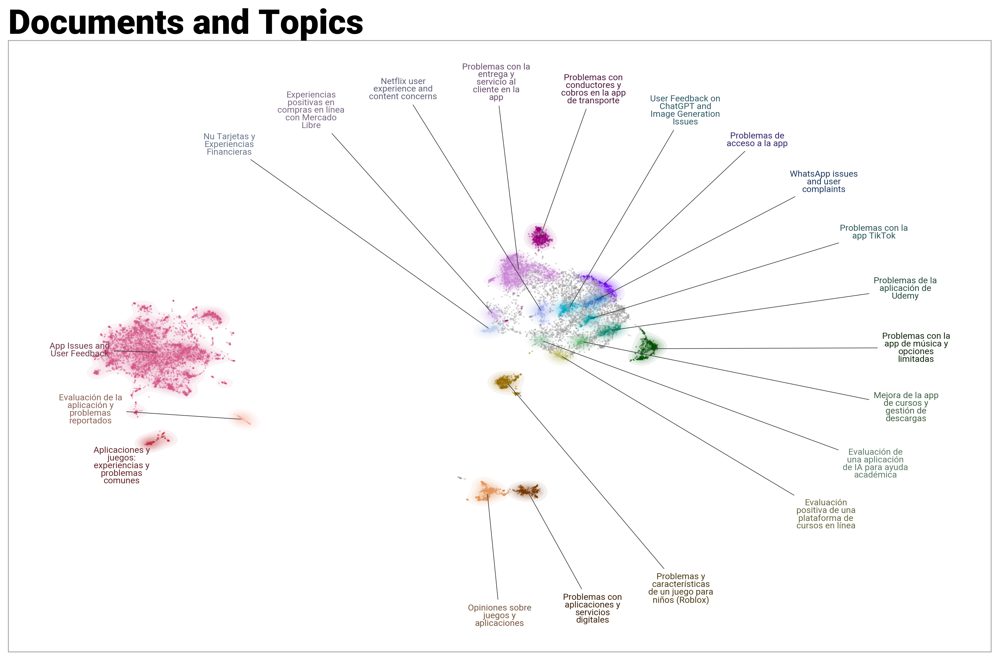
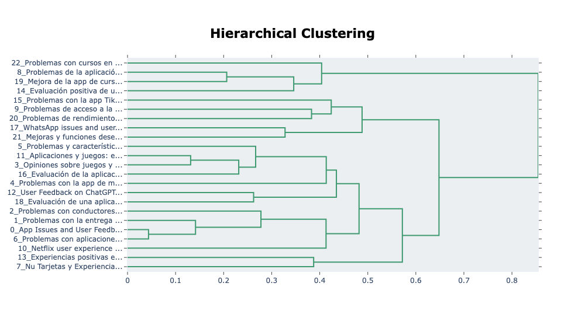

# 📊 PlayScraper API: Análisis Inteligente de Reseñas 🚀

**Transforma miles de reseñas de la Google Play Store en _insights_ de negocio accionables.**

Esta herramienta automatiza la extracción y el análisis de opiniones de usuarios, utilizando **Topic Modeling** y **Modelos de Lenguaje Avanzados (LLMs)** para revelar patrones, problemas y tendencias ocultas en los datos.

---

## 🎯 Propósito y Origen de los Datos

### Objetivo Principal

El objetivo de esta aplicación es ofrecer a los equipos de producto, desarrolladores y analistas una herramienta poderosa para entender a sus usuarios a gran escala. En lugar de leer miles de comentarios manualmente, **PlayScraper API** procesa y resume automáticamente el feedback para facilitar la toma de decisiones estratégicas, identificar bugs críticos y descubrir oportunidades de mejora.

### Fuente de Datos

La información se extrae directamente de las **reseñas públicas de aplicaciones en la Google Play Store**. El conjunto de datos de ejemplo (`data/reviews_apps.csv`) contiene una colección de reseñas reales de diversas aplicaciones populares, permitiendo demostrar la capacidad de análisis del modelo en un escenario real y variado.

---

## ✨ Visualizaciones Clave

Nuestras visualizaciones están diseñadas para ofrecer una comprensión clara y rápida de lo que realmente dicen tus usuarios.

### 🗺️ **Mapa de Temas y Conversaciones**

Este mapa interactivo agrupa miles de reseñas en clústeres temáticos. De un solo vistazo, puedes identificar las conversaciones dominantes, desde **problemas técnicos** y **sugerencias de mejora** hasta **experiencias de usuario positivas**.

 

  

### 🌳 **Jerarquía de Insights**

Comprende la estructura de las opiniones. Este diagrama revela cómo los temas específicos se anidan dentro de categorías más amplias, permitiéndote explorar desde un problema general hasta sus causas raíz.

 

  

---

## 🛠️ Funcionalidades Destacadas

- 📲 **Extracción Automatizada**: Olvídate de la recolección manual. Conecta la API a cualquier app de la Google Play Store.
- 🧠 **Análisis con IA**: Utiliza `BERTopic` para un modelado de temas robusto y preciso.
- 📈 **Inteligencia Accionable**: Descubre automáticamente problemas críticos, elogia funciones amadas y detecta oportunidades de mejora.
- 🎨 **Dashboards Intuitivos**: Los resultados se presentan en gráficos claros y fáciles de interpretar, listos para compartir con tu equipo.
- ⚙️ **Proceso Eficiente**: Todo el pipeline, desde la limpieza de datos hasta la visualización, está optimizado para la velocidad y la precisión.

---
